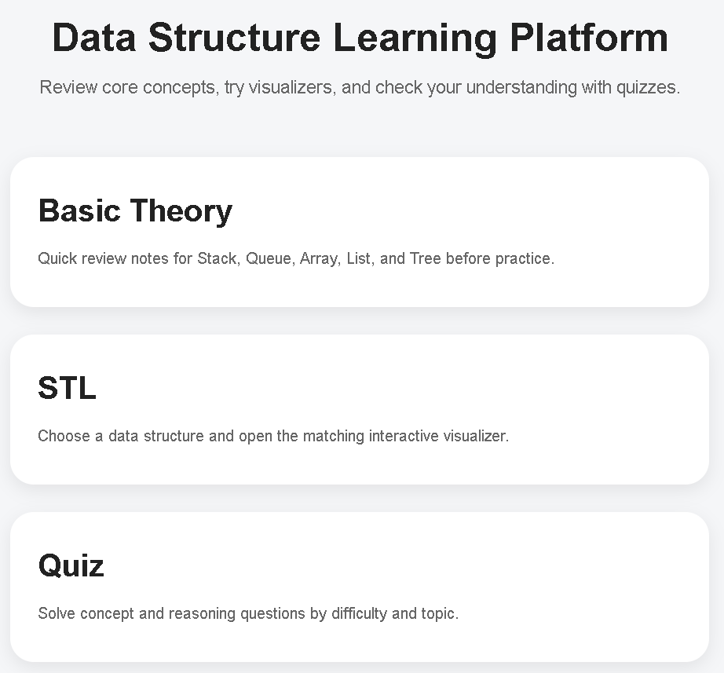
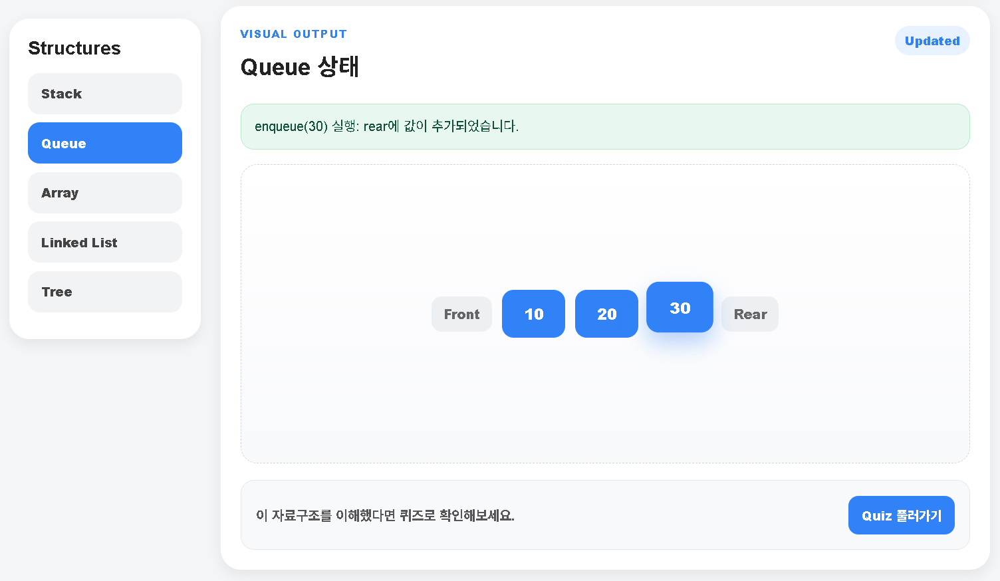
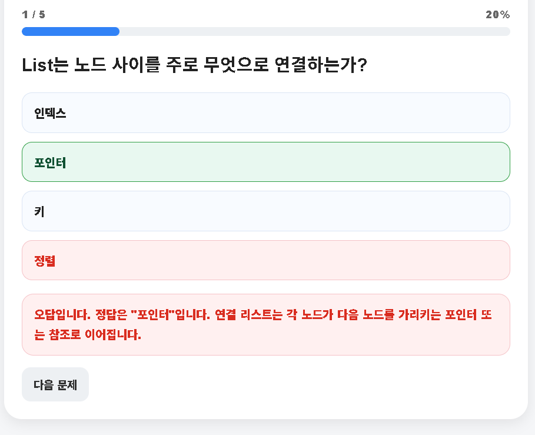

# Data Structure Learning Platform

자료구조를 이론, 시각화, 퀴즈, 코드 실행 흐름으로 함께 학습할 수 있는 웹 기반 학습 플랫폼입니다.  
Stack, Queue, Array, List, Tree의 핵심 개념과 연산 과정을 빠르게 복습하고 직접 확인할 수 있도록 구성했습니다.

---

## 🌐 Demo

👉 https://your-github-pages-link

---

## 🚀 주요 기능

- **Visualizer**  
  Stack, Queue, Array, List, Tree를 선택해 주요 연산 결과를 시각적으로 확인

- **Quiz**  
  난이도 및 카테고리 기반 문제 풀이  
  정답/오답 피드백, 해설, 결과 차트 제공

- **Theory**  
  시험 전 복습용 핵심 개념 정리

- **Code Visualizer**  
  ADT 명령을 입력하여 자료구조 상태 변화를 단계별로 확인

---

## 🛠️ Tech Stack

- HTML
- CSS
- JavaScript
- GitHub Pages

---

## � Screenshots

| Home | Visualizer | Quiz |
|------|------------|------|
|  |  |  |

---

## �📚 주요 자료구조

- Stack
- Queue
- Array
- List
- Tree

---

## 📁 프로젝트 구조

```text
.
├── index.html
├── theory.html
├── stl.html
├── visualizer.html
├── adt-visualizer.html
├── quiz.html
├── common.css
├── visualizer.css/js
├── adt-visualizer.css/js
├── quiz.css/js
├── stl.css/js
├── legacy/
└── legacy-assets/